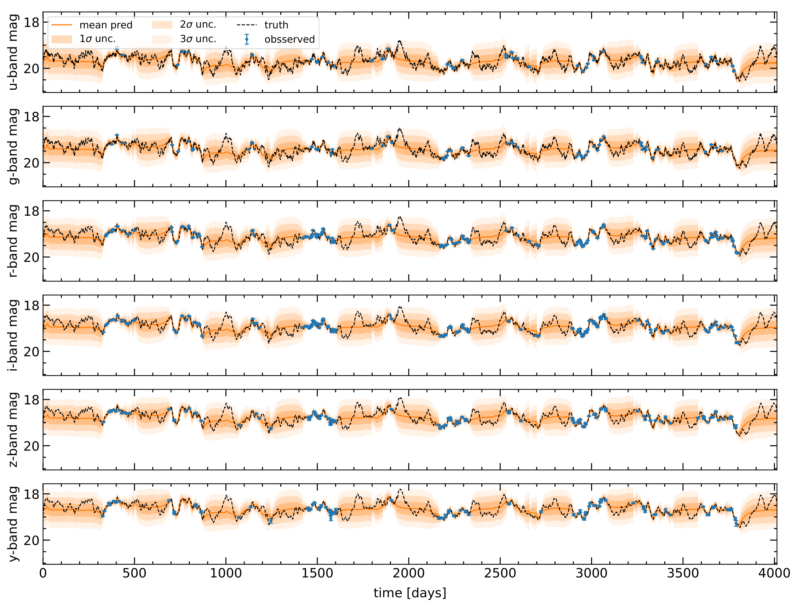
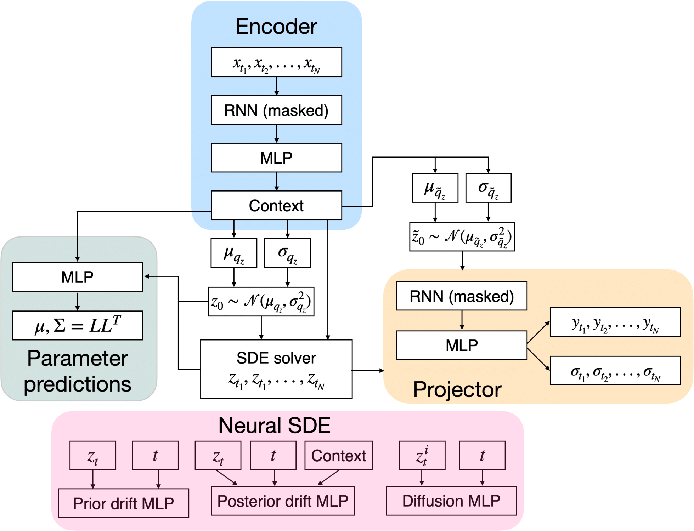

# Latent SDEs for Modeling Quasar Variability and Inferring Black Hole Properties

Code for "Latent Stochastic Differential Equations for Modeling Quasar Variability and Inferring Black Hole Properties" [[arXiv]](https://arxiv.org/abs/2304.04277). Here we model quasar variability as a [stochastic differential equation (SDE)](https://en.wikipedia.org/wiki/Stochastic_differential_equation) using latent SDEs. Our model can simultaneously reconstruct quasar light curves including at unobserved times and perform parameter inference on variability and black hole properties. Our method is applicable to any time series with missing or irregularly sampled data. 

<p align="center">
  
</p>

## Background
[Quasar](https://en.wikipedia.org/wiki/Quasar) are extremely bright [AGN](https://en.wikipedia.org/wiki/Active_galactic_nucleus) powered by [super massive black holes (SMBH)](https://en.wikipedia.org/wiki/Supermassive_black_hole) at the center of galaxies. The variability in the brightness of quasars is often modeled as a damped random walk (DRW), also known as the [Ornstein-Uhlenbeck process](https://en.wikipedia.org/wiki/Ornstein%E2%80%93Uhlenbeck_process). The DRW is a type of [Gaussian process](https://en.wikipedia.org/wiki/Gaussian_process) governed by the stochastic differential equation:

```math
dX(t) = -\frac{1}{\tau} X(t) dt +\sigma \sqrt{dt} \epsilon(t) + bdt
```

where $\epsilon(t)$ is a white noise process with mean zero and variance one. $X(t)$ has standard deviation $SF_\infty = \sigma\sqrt{\tau/2}$ with characteristic time scale $\tau$ and mean $\overline{X} = b\tau$. We model this process by incoorperating a neural SDE as the decoder in a modified version of a [variational auto encoter (VAE)](https://en.wikipedia.org/wiki/Variational_autoencoder). We also directly predict the variability parameters $SF_\infty$ and $\tau$ as well as properties of the black hole such as its mass, inclination angle, and temperature slope. We use a realistic, physics-based simulation to model ten year quasar [light curves](https://en.wikipedia.org/wiki/Light_curve) across six different bandpasses (*ugrizy*) in preperation for the [Rubin Observatory Legacy Survey of Space and Time (LSST)](https://en.wikipedia.org/wiki/Vera_C._Rubin_Observatory). Simulated LSST observations and photometric errors are included from [rubin_sim](https://github.com/lsst/rubin_sim). We show our method outperforms a Gaussian process regression baseline at light curve reconstruction.

<p align="center">
  
</p>

## Citation

If you found this codebase useful in your research, please consider citing:

```
@article{Fagin_2024,
doi = {10.3847/1538-4357/ad2988},
url = {https://dx.doi.org/10.3847/1538-4357/ad2988},
year = {2024},
month = {apr},
publisher = {The American Astronomical Society},
volume = {965},
number = {2},
pages = {104},
author = {Joshua Fagin and Ji Won Park and Henry Best and James H. H. Chan and K. E. Saavik Ford and Matthew J. Graham and V. Ashley Villar and Shirley Ho and Matthew O’Dowd},
title = {Latent Stochastic Differential Equations for Modeling Quasar Variability and Inferring Black Hole Properties},
journal = {The Astrophysical Journal},
}
```

### Contact
For inquiries or to request the full training set, reach out to: jfagin@gradcenter.cuny.edu

### References
- Joshua Fagin, Ji Won Park, Henry Best, James Hung-Hsu Chan, K.E Saavik Ford, Matthew J. Graham, V. Ashley Villar, Shirley Ho, Matthew O'Dowd. "Latent Stochastic Differential Equations for Modeling Quasar Variability and Inferring Black Hole Properties". 2023. [[arXiv]](https://arxiv.org/abs/2304.04277) 
- Xuechen Li, Ting-Kam Leonard Wong, Ricky T. Q. Chen, David Duvenaud. "Scalable Gradients for Stochastic Differential Equations". *International Conference on Artificial Intelligence and Statistics.* 2020. [[arXiv]](https://arxiv.org/pdf/2001.01328.pdf)
- Zhengping Che, Sanjay Purushotham, Kyunghyun Cho, David Sontag, Yan Liu. "Recurrent Neural Networks for Multivariate Time Series with Missing Values
". *Nature.* 2018. [[arXiv]](https://arxiv.org/pdf/2001.01328.pdf)

### Older version of latent SDE
https://github.com/jiwoncpark/magnify
